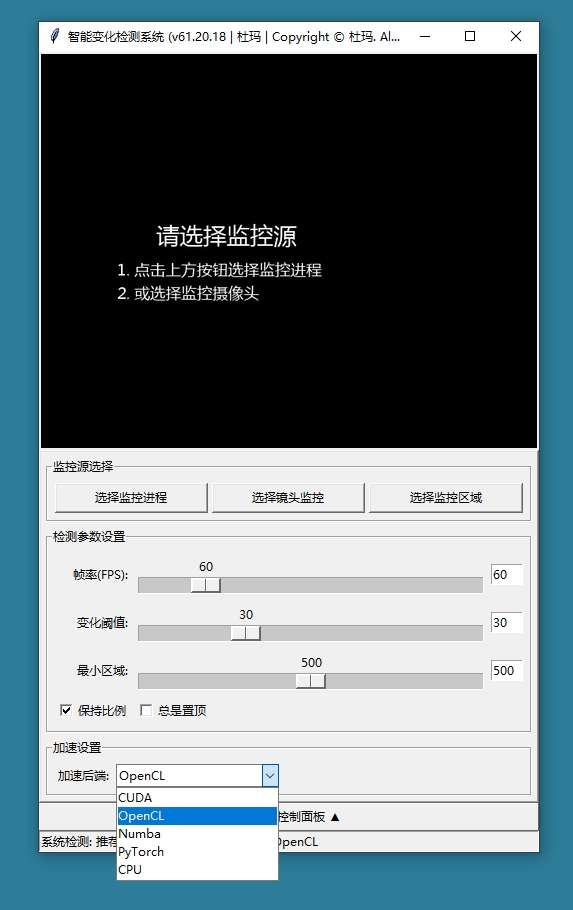

# 智能变化检测系统使用说明书

## 一、产品概述
智能变化检测系统是一款专业的实时监控软件，能够检测并标记指定窗口或摄像头画面中的变化区域。本系统广泛应用于安全监控、自动化测试、用户行为分析等多个领域。

## 二、系统要求
- 操作系统：Windows 7/10/11
- Python环境：Python 3.6+
- 必要库：OpenCV, Tkinter, PIL, NumPy, MSS, PyWin32, psutil

## 三、安装指南
1. 安装Python环境
2. 安装依赖库：`pip install opencv-python pillow numpy mss pywin32 psutil`
3. 下载本程序文件`real_time_detection.py`

## 四、功能说明

### 1. 主控制面板

- 版本显示：右上角显示当前版本号(v61.0.14)
- 状态栏：底部显示系统当前状态

### 2. 监控源选择
#### 进程监控模式
- 点击"选择监控进程"按钮
- 在弹出的窗口中选择要监控的应用程序
- 支持按PID、进程名或窗口标题搜索
- 双击可直接选择进程

#### 摄像头监控模式
- 点击"选择镜头监控"按钮
- 系统会自动检测可用摄像头
- 选择要监控的摄像头ID

### 3. 监控区域控制
#### 选择监控区域
- 必须先选择监控进程
- 点击"选择目标监控区域"按钮
- 在目标窗口上拖动鼠标选择监控区域
- 释放鼠标左键确认选择

#### 调整结果窗口
- 点击"调整结果窗口大小"按钮
- 系统会根据当前设置调整结果窗口大小

### 4. 检测参数设置
#### 帧率控制(FPS)
- 范围：1-120 FPS
- 可通过滑块或直接输入数值调整
- 默认值：30 FPS

#### 变化检测阈值
- 范围：1-100
- 数值越小越敏感
- 默认值：30

#### 最小变化区域
- 范围：1-1000像素
- 过滤掉小于此值的变化区域
- 默认值：500

#### 窗口选项
- 总是置顶变化结果面板：勾选后结果窗口将保持最前
- 锁定结果窗口宽高比：保持原始画面比例

## 五、使用场景

### 1. 安全监控
- 监控重要区域的变化
- 检测异常活动

### 2. 自动化测试
- 监控应用程序界面变化
- 验证UI更新

### 3. 用户行为研究
- 记录用户操作轨迹
- 分析用户交互模式

## 六、高级功能

### 1. ROI(感兴趣区域)选择
- 在结果窗口中拖动鼠标左键选择特定区域
- 右键点击重置ROI
- 系统会聚焦显示选定区域

### 2. 多进程监控
- 可随时切换监控不同进程
- 支持同时监控多个窗口(需多次运行程序)

## 七、常见问题

### Q1: 无法检测到摄像头
- 检查摄像头是否被其他程序占用
- 尝试重新插拔摄像头
- 确认摄像头驱动已正确安装

### Q2: 检测结果不准确
- 调整变化检测阈值
- 增大最小变化区域值
- 确保监控区域选择正确

### Q3: 程序无响应
- 降低帧率设置
- 缩小监控区域范围
- 关闭不必要的应用程序

## 八、版本更新
当前版本：v61.0.14
更新内容：
- 优化了ROI选择功能
- 增加了窗口宽高比锁定选项
- 修复了若干稳定性问题

## 九、技术支持
如有任何问题，请联系技术支持团队：
- 邮箱：
- 电话：

## 十、免责声明
本软件仅供合法用途，使用者应遵守当地法律法规。开发者不对软件的滥用行为负责。

---

**注意**：本说明书中的图片仅为示意图，实际界面可能略有不同。具体操作请以实际软件界面为准。
